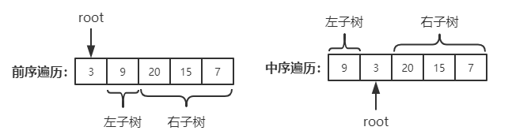

# 从前序与中序遍历序列构造二叉树

来源：力扣（LeetCode）  
链接：<https://leetcode-cn.com/problems/construct-binary-tree-from-preorder-and-inorder-traversal/>

根据一棵树的前序遍历与中序遍历构造二叉树。

注意:
你可以假设树中没有重复的元素。

示例：

``` c++
前序遍历 preorder = [3,9,20,15,7]
中序遍历 inorder = [9,3,15,20,7]
```

返回如下的二叉树：

``` c++
    3
   / \
  9  20
    /  \
   15   7
```

</br>

---

## 思路

二叉树前序遍历的顺序是：`<根左右>`, 中序遍历的顺序是`<左根右>`，那么由此可以算出，只要一直递归找到数组中的左右子树和根的位置，即可解出该题。  
那么如何找到左右子树的边界和根的位置呢？我们知道，前序遍历的第一个数就是二叉树根的值，这个值在中序遍历的数组中将左右子树隔开，所以中序遍历数组的左边是左子树，右边是右子树，根左边的第一个数，在前序遍历数组中，是左子树的右边界，即可知道前序遍历数组的右子树的范围。  
如下图：  


</br>

## 解题

``` c++
/**
 * Definition for singly-linked list.
 * struct ListNode {
 *     int val;
 *     ListNode *next;
 *     ListNode(int x) : val(x), next(NULL) {}
 * };
 */
class Solution {
public:
    int getIndex(vector<int>& vec, int val, int start_index, int end_index) {
        int index = 0;
        for (int i = start_index; i <= end_index; ++i) {
            if (val == vec[i]) {
                index = i;
                break;
            }
        }
        return index;
    }

    void buildSubTree(vector<int>& preorder, vector<int>& inorder, int ps, int pe, int ins, int ine, TreeNode* root) {
        if (root == NULL) return;
        if (ins == ine) {
            root->val = preorder[ps];
            return;
        }

        root->val = preorder[ps];
        // inorder sub tree range
        // 中序遍历结构中，获取根节点的位置，根节点的左边就是左子树，右边就是右子树
        int inRootIndex = getIndex(inorder, preorder[ps], ins, ine);
        // 获取左子树的长度
        int leftSubTreeLen = inRootIndex - ins;

        if (inRootIndex - 1 >= 0) root->left = new TreeNode(0);
        if (inRootIndex < ine) root->right = new TreeNode(0);
        buildSubTree(preorder, inorder, ps + 1, ps + leftSubTreeLen, ins, inRootIndex - 1, root->left);
        buildSubTree(preorder, inorder, ps + leftSubTreeLen + 1, pe, inRootIndex + 1, root->right);
    }

    TreeNode* buildTree(vector<int>& preorder, vector<int>& inorder) {
        if (preorder.size() == 0) return NULL;
        if (preorder.size() == 1) return new TreeNode(preorder[0]);

        TreeNode* root = new TreeNode(preorder[0]);
        buildSubTree(preorder, inorder, 0, preorder.size()-1, 0, inorder.size()-1, root);
        return root;
    }
};
```

这个解法leetcode上提交`runtime error`了，整体思路应该是没问题的，主要的耗时是在每次迭代都需要查找根节点上，那么如何优化呢？如果想要查找时间复杂度为O(1),第一时间想到的是哈希表，我们可以用哈希表记录每个元素的下标位置，那查找根节点的时候，就可以达到O(1)的时间复杂度了。  
以下是优化之后的代码：  

``` c++
/**
 * Definition for a binary tree node.
 * struct TreeNode {
 *     int val;
 *     TreeNode *left;
 *     TreeNode *right;
 *     TreeNode(int x) : val(x), left(NULL), right(NULL) {}
 * };
 */
class Solution {
private:
    unordered_map<int, int> val_index;
public:
    TreeNode* buildSubTree(vector<int>& preorder, vector<int>& inorder, int ps, int pe, int ins, int ine) {
        if (ins > ine) {
            return NULL;
        }

        // inorder sub tree range
        // 前序遍历中的第一个节点为根节点
        // 在中序遍历结构中，获取根节点的位置，根节点的左边就是左子树，右边就是右子树
        int inRootIndex = val_index[preorder[ps]];
        // 创建根节点
        TreeNode* root = new TreeNode(preorder[ps]);
        // 获取左子树的长度
        int leftSubTreeLen = inRootIndex - ins;
        // 构造左子树
        root->left = buildSubTree(preorder, inorder, ps + 1, ps + leftSubTreeLen, ins, inRootIndex - 1);
        // 构造右子树
        root->right = buildSubTree(preorder, inorder, ps + leftSubTreeLen + 1, pe, inRootIndex + 1, ine);
        return root;
    }

    TreeNode* buildTree(vector<int>& preorder, vector<int>& inorder) {
        int len = preorder.size();
        for (int i = 0; i < len; ++i) {
            val_index[inorder[i]] = i;
        }
        return buildSubTree(preorder, inorder, 0, len - 1, 0, len - 1);
    }
};
```
