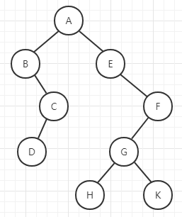

# 验证二叉搜索树

来源：力扣（LeetCode）  
链接：<https://leetcode-cn.com/problems/validate-binary-search-tree/>

给定一个二叉树，判断其是否是一个有效的二叉搜索树。

假设一个二叉搜索树具有如下特征：

* 节点的左子树只包含小于当前节点的数。
* 节点的右子树只包含大于当前节点的数。
* 所有左子树和右子树自身必须也是二叉搜索树。

示例1：

``` c++
输入:
    2
   / \
  1   3
输出: true
```

示例2：

``` c++
输入:
    5
   / \
  1   4
     / \
    3   6
输出: false
解释: 输入为: [5,1,4,null,null,3,6]。
     根节点的值为 5 ，但是其右子节点值为 4 。
```

</br>

---

## 思路

根据二叉搜索树的性质，通过中序遍历时节点的值是升序的，所以可以利用last指针记录上一次访问的节点值，每次访问节点都使用last值与当前节点比较是否是升序来判断。

算法时间复杂度：  
O(n)

</br>

## 解题

``` c++
/**
 * Definition for a binary tree node.
 * struct TreeNode {
 *     int val;
 *     TreeNode *left;
 *     TreeNode *right;
 *     TreeNode(int x) : val(x), left(NULL), right(NULL) {}
 * };
 */
class Solution {
public:
    int *m_last;
public:
    // 中序遍历
    bool isValidBST(TreeNode* root) {
        if (root) {
            if (!isValidBST(root->left)) return false; // 遍历左节点
            if (m_last && *m_last >= root->val) return false; // 根据二叉搜索树的性质，可知中序遍历的节点值是升序的，通过此处判断可知是不是二叉搜索树
            m_last = &root->val; // 记录上次的节点值
            if (!isValidBST(root->right)) return false; // 遍历右节点
        }
        return true;
    }
};
```

</br>

---

## 扩展

### 二叉树

**定义：**  
二叉树是n(n>=0)个结点的有限集合，该集合或者为空集（称为空二叉树），或者由一个根结点和两棵互不相交的、分别称为根结点的左子树和右子树组成。  
下图是一颗普通二叉树：


**特点：**

1. 每个节点最多有两棵子树，即二叉树不存在度大于2的节点
2. 二叉树的子树有左右之分，其子树的次序不能颠倒
3. 即使树中某结点只有一棵子树，也要区分它是左子树还是右子树。

**性质：**  

1. 在二叉树的第i（i>=1）层最多有2^(i - 1)个结点。
2. 深度为k(k>=0)的二叉树最少有k个结点，最多有2^k－1个结点。
3. 对于任一棵非空二叉树，若其叶结点数为n0，度为2的非叶结点数为n2，则n0 = n2 + 1。
4. 具有n个结点的完全二叉树的深度为int_UP(log(2，n+1)))。
5. 如果将一棵有n个结点的完全二叉树自顶向下，同一层自左向右连续给结点编号1,2,3,......,n ，然后按此结点编号将树中各结点顺序的存放于一个一维数组，并简称编号为i的结点为结点i( i>=1 && i<=n ),则有以下关系：
（1）若 i = 1，则结点i为根，无父结点；若 i > 1，则结点 i 的父结点为结点int_DOWN(i / 2);
（2）若 2 * i <= n，则结点 i 的左子女为结点 2 * i;
（3）若 2 * i <= n，则结点 i 的右子女为结点 2 * i + 1;
（4）若结点编号i为奇数，且i != 1，它处于右兄弟位置，则它的左兄弟为结点i - 1;
（5）若结点编号i为偶数，且i != n，它处于左兄弟位置，则它的右兄弟为结点i + 1;
（6）结点i所在的层次为 int_DOWN(log(2，i)) + 1。

### 二叉树的遍历

二叉树的遍历有四种方式：

1. 前序遍历：先访问根节点，然后前序遍历左子树，再前序遍历右子树。<根 左 右>
2. 中序遍历：遍历根节点的左子树，然后是访问根节点，最后遍历右子树。<左 根 右>
3. 后序遍历：从左到右先叶子节点的方式遍历访问左右子树，最后访问根节点。<左 右 根>
4. 层序遍历：从根节点从上往下逐层遍历，在同一层，按从左到右的顺序对节点逐个访问。

二叉树的基本数据结构如下：

``` c
struct TreeNode {
    int val;
    TreeNode *left;
    TreeNode *right;
    TreeNode(int x) : val(x), left(NULL), right(NULL) {}
};
```

举个例子：  


**前序遍历：A B C D E F G H K**  
代码实现如下：

``` c
void preOrder(TreeNode *root) {
    if (!root) return;

    std::cout << root->val << std::endl; // 访问根节点
    preOrder(root->left); // 遍历左子树
    preOrder(root->right); // 遍历右子树
}
```

</br>

**中序遍历：B D C A E H G K F**  
代码实现如下：

``` c
void inOrder(TreeNode *root) {
    if (!root) return;

    preOrder(root->left); // 遍历左子树
    std::cout << root->val << std::endl; // 访问根节点
    preOrder(root->right); // 遍历右子树
}
```

</br>

**后序遍历：D C B H K G F E A**  
代码实现如下：

``` c
void postOrder(TreeNode *root) {
    if (!root) return;

    preOrder(root->left); // 遍历左子树
    preOrder(root->right); // 遍历右子树
    std::cout << root->val << std::endl; // 访问根节点
}
```

</br>

**层序遍历：A B E C F D G H K**  
代码实现如下：

``` c
// 需要通过队列来辅助实现，因为队列右先进先出的性质。
void levelOrder(TreeNode *root) {
    if (!root) return;

    std::queue<TreeNode *> q;
    TreeNode *front;

    q.push(root);
    while (!q.empty())
    {
        front = q.front();
        q.pop();

        if (front->left) q.push(front->left);
        if (front->right) q.push(front->right);
        std::cout << front->val << std::endl; // 访问节点
    }
}
```
