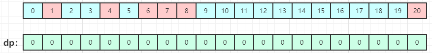
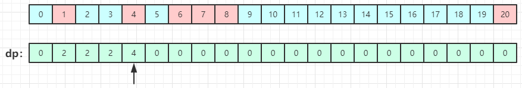
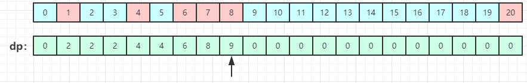
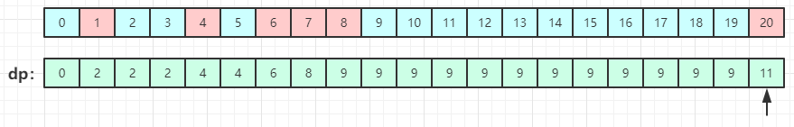

# 最低票价

来源：力扣（LeetCode）  
链接：<https://leetcode-cn.com/problems/minimum-cost-for-tickets/>

在一个火车旅行很受欢迎的国度，你提前一年计划了一些火车旅行。在接下来的一年里，你要旅行的日子将以一个名为 days 的数组给出。每一项是一个从 1 到 365 的整数。

火车票有三种不同的销售方式：

一张为期一天的通行证售价为 costs[0] 美元；
一张为期七天的通行证售价为 costs[1] 美元；
一张为期三十天的通行证售价为 costs[2] 美元。
通行证允许数天无限制的旅行。 例如，如果我们在第 2 天获得一张为期 7 天的通行证，那么我们可以连着旅行 7 天：第 2 天、第 3 天、第 4 天、第 5 天、第 6 天、第 7 天和第 8 天。

返回你想要完成在给定的列表 days 中列出的每一天的旅行所需要的最低消费。

示例1：

``` c++
输入：days = [1,4,6,7,8,20], costs = [2,7,15]
输出：11
解释：
例如，这里有一种购买通行证的方法，可以让你完成你的旅行计划：
在第 1 天，你花了 costs[0] = $2 买了一张为期 1 天的通行证，它将在第 1 天生效。
在第 3 天，你花了 costs[1] = $7 买了一张为期 7 天的通行证，它将在第 3, 4, ..., 9 天生效。
在第 20 天，你花了 costs[0] = $2 买了一张为期 1 天的通行证，它将在第 20 天生效。
你总共花了 $11，并完成了你计划的每一天旅行。
```

示例2：

``` c++
输入：days = [1,2,3,4,5,6,7,8,9,10,30,31], costs = [2,7,15]
输出：17
解释：
例如，这里有一种购买通行证的方法，可以让你完成你的旅行计划：
在第 1 天，你花了 costs[2] = $15 买了一张为期 30 天的通行证，它将在第 1, 2, ..., 30 天生效。
在第 31 天，你花了 costs[0] = $2 买了一张为期 1 天的通行证，它将在第 31 天生效。
你总共花了 $17，并完成了你计划的每一天旅行。
```

---

## 思路

使用动态规划思路：  
从前往后迭代，计算出每一天以当前日期截止累计花费的最优解。  
定义一个dp数组，长度选择days中最后一天的天数加一个长度，因为一开始没有任何费用，所有初始化为0，如下图：  

然后每到达一个位置时，判断是否为出行日期，如果不是出行日期，那么当天累计的花费费用肯定和它前一天为止的费用相同。当到达的位置是出行日期，即到达第i天时，有如下三种购票方案：  

* cost1 = dp[i-1] + costs[0]
* cost2 = dp[i > 7 ? i - 7 : 0] + costs[1]
* cost3 = dp[i > 30 ? i - 30 : 0] + costs[2]  

从以上三种方案中选取花费最少的方案min(cost1, cost2, cost3)，就是到达第i天累计花费的最优解。  
图解如下：  
当到达第1天时，花费费用为2，因为第2第3天不是出行日期，所有不会产生费用，目前为止还是花费2。到达第四天时，
根据以上三种购票方案，可知最少费用是4。

当到达第8天时，根据上述公式，可以得到第一种方案费用cost1=10，第二种方案为cost2=9（也就是从第2天开始买为期七天的通行证），第三种方案为cost3=15，所以最优解为9。  

以此类推，到达最后一天时，花费的费用就是dp数组的最后一个元素的值。


时间复杂度：  
O(N)，N为days数组里的最后一天的日期。

</br>

## 解题

``` c++
class Solution {
public:
    int mincostTickets(vector<int>& days, vector<int>& costs) {
        int last_day = days[days.size() - 1];

        vector<int> dp(last_day + 1, 0); // dp数组初始为0
        int days_index = 0;
        int cost = INT_MAX; // 定义边界
        int sevenDaysAgo = 0, thirtyDaysAgo = 0;
        for (int i = 1; i < dp.size(); ++i) {
            if (i == days[days_index]) {
                cost = INT_MAX;
                sevenDaysAgo = i - 7 > 0 ? i - 7 : 0; // 当前日期的第七天前的费用
                thirtyDaysAgo = i - 30 > 0 ? i - 30 : 0; // 当前日期的第三十天前的费用

                // 选取最少花费的方案
                cost = min(dp[i - 1] + costs[0], cost);
                cost = min(dp[sevenDaysAgo] + costs[1], cost);
                cost = min(dp[thirtyDaysAgo] + costs[2], cost);
                dp[i] = cost;
                ++days_index;
            } else {
                dp[i] = dp[i - 1];
            }
        }
        return dp[last_day];
    }
};
```
